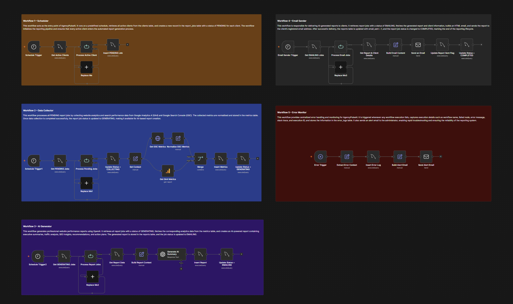

# AgencyPulseAI 🚀
### AI-Powered Automated Client Reporting Platform

AgencyPulseAI is a production-ready reporting automation platform built with n8n, MySQL, Google Analytics 4 (GA4), Google Search Console (GSC), OpenAI, and Email Services.

## Project Overview
AgencyPulseAI automates the complete client reporting lifecycle:
- Collects analytics and SEO metrics automatically
- Generates AI-powered reports
- Sends reports to clients via email
- Logs failures and sends administrator alerts
- Scales reporting operations across multiple clients

## Tech Stack
- n8n
- MySQL 8
- Google Analytics 4 (GA4)
- Google Search Console (GSC)
- OpenAI
- Gmail / Mailpit
- Docker

## Canonical Workflow Architecture

### Workflow 1 – Scheduler
Schedule Trigger
→ Get Active Clients
→ Loop Over Items
→ Insert PENDING report_jobs

Purpose:
Creates report jobs for every active client and initializes the reporting pipeline.

### Workflow 2 – Data Collector
Schedule Trigger
→ Get PENDING Jobs
→ Update Status = COLLECTING
→ Get GA4 Metrics
→ Get GSC Metrics
→ Normalize Metrics
→ Insert Metrics
→ Update Status = GENERATING

Purpose:
Collects website traffic and SEO metrics and stores them in MySQL.

Metrics:
GA4:
- Sessions
- Users
- Page Views
- Event Count

GSC:
- Clicks
- Impressions
- CTR
- Average Position

### Workflow 3 – AI Generator
Schedule Trigger
→ Get GENERATING Jobs
→ Get Metrics Data
→ Build Report Context
→ OpenAI
→ Insert Report
→ Update Status = EMAILING

Purpose:
Generates professional AI-powered reports including:
1. Executive Summary
2. Traffic Analysis
3. SEO Analysis
4. Key Insights
5. Recommendations
6. Next Month Action Plan

### Workflow 4 – Email Sender
Schedule Trigger
→ Get EMAILING Jobs
→ Get Report & Client Details
→ Build Email Content
→ Send Report Email
→ Update Status = COMPLETED

Purpose:
Automatically delivers reports and tracks email delivery.

### Workflow 5 – Error Monitor
Error Trigger
→ Extract Error Context
→ Insert Error Log
→ Send Alert Email

Purpose:
Provides centralized monitoring and incident handling.

## Database
Database Name: AgencyPulseAI_db

Core Tables:
- clients
- metrics
- report_jobs
- report_runs
- reports
- error_logs

report_jobs Status Flow:
PENDING → COLLECTING → GENERATING → EMAILING → COMPLETED

## Production Design Principles
- Status-driven architecture
- Decoupled workflows
- Centralized error handling
- Database persistence
- Scalable client onboarding
- Docker-based deployment
- AI-powered report generation

## Business Impact

Before Automation:
- Manual data collection from GA4 and GSC
- Spreadsheet-based reporting
- Manual report writing
- Manual email delivery
- High operational costs
- Human errors

After Automation:
- Fully automated reporting pipeline
- AI-generated professional insights
- Standardized reporting
- Automated delivery
- Real-time monitoring
- Scalable operations

Estimated Benefits:
- 80–90% reduction in reporting effort
- 10–20+ hours saved per month per account manager
- Faster report turnaround
- Improved productivity
- Better client experience
- Ability to support hundreds of clients without proportional staffing increases

## Future Enhancements
- PDF report generation
- White-label reporting
- Client dashboard portal
- Weekly and quarterly reporting
- Predictive analytics
- Trend forecasting
- Multi-tenant support
- Role-Based Access Control (RBAC)

## Author
Ayush
AI Automation Engineer | n8n Developer | AI Workflow Builder

Open to:
- Freelance Projects
- Automation Consulting
- Collaboration Opportunities

AgencyPulseAI transforms manual reporting into intelligent, AI-powered automation.
